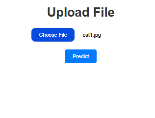
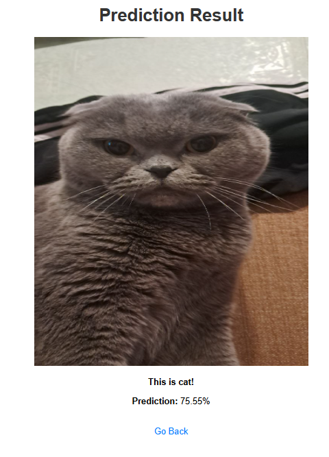

# cat_and_dog_classification_app
## Project Overview
This project is a machine learning-based image classification service. It uses a neural network trained on a labeled dataset to classify images of cats and dogs. The trained model is deployed using FastAPI with a user-friendly interface for uploading images and viewing predictions.

The model was trained and evaluated in a [Google Colab Notebook](https://colab.research.google.com/drive/1q0ZLlU4Vcwc1mz0CkEbtZR0Wx5E_z0MH?usp=sharing).
The notebook includes:
- Data preprocessing.
- Model training.
- Model evaluation achieving [96% accuracy].

## Dataset
The dataset used for this project is the [Dataset](https://www.kaggle.com/datasets/ashfakyeafi/cat-dog-images-for-classification/data). It contains labeled images for cats and dogs.


## Installation
```bash
git clone https://github.com/kapitoshk4/cat_and_dog_classification_app.git
cd cat_and_dog_classification_app
python3 -m venv venv
source venv/scripts/activate
pip install -r requierements.txt
```
## Running the app
```bash
python -m uvicorn main:app --reload
```

Open your browser and go to http://127.0.0.1:8000.
Upload an image for classification and view the result.

## Example of Prediction
Upload file page:



Prediction page:

